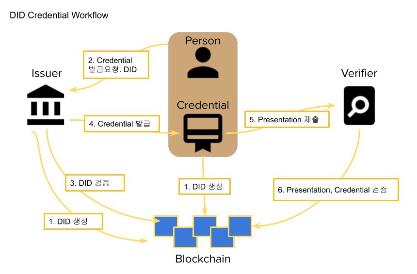

# Metadium DID SDK for Java

DID 생성 및 키 관리 기능과 [Verifiable Credential](https://www.w3.org/TR/vc-data-model/) 의 서명과 검증에 대한 기능을 Java 또는 Android 에 제공합니다. 

## 용어정리

- DID (탈중앙화 신원증명 : Decentralized Identity)
    - 개인의 데이터를 중앙화된 기관을 거치지 않으면서도 검증이 가능하게 하는 개념.
    - [W3C DID Spec](https://www.w3.org/TR/did-core/)

- Claim
    - 전체데이터의 각 단위 데이터 입니다.
    - 예를 들어 디지털 신원 정보에서 이름, 생년월일, 성별 등과 각각의 값을 페어로 claim 이라 불림.
    - [W3C VC Claims](https://www.w3.org/TR/vc-data-model/#claims)

- Verifiable Credential
    - 발급자, 유효기한, 검증에 사용되는 발급자의 공개키 등과  claim 의 집합과 서명을 포함하는 검증 가능한 Credential 입니다.
    - 위변조가 불가능하며 예로 휴대폰본인인증, 전자신분증 등 신원인증이 있습니다.
    - 발급자가 사용자의 정보를 인증하여 발급하고 사용자에게 전달됩니다.
    - [W3C VC Credential](https://www.w3.org/TR/vc-data-model/#credentials)
    
- Verifiable Presentation
    - 하나 이상의 Verifiable Credential 과 소유자의 공개키와 서명을 포함하는 검증 가능한 Presentation 입니다.
    - 소유자가 발급자에게서 발급 받은 credential 을 검증자에게 제출 시 사용됩니다.
    - [W3C VC Presentation](https://www.w3.org/TR/vc-data-model/#presentations)

## DID Workflow


1. 발급자(Issuer)와 사용자(Holder)는 Credential, Presentation 을 발급하기 위해 DID 를 미리 생성한다.
    - [DID 생성](#create-did)
2. 사용자는 발급자에게 Credential 발급 요청을 한다. 사용자가 발급하려는 Credential의 소유자라는 임을 확인하기 위해 DID 를 전달합니다.
    - 전달하는 DID에 대한 검증이 필요할 시 Credential 을 포함하지 않는 Presentation 을 전달
    -  [Presentation 발급](#issue-presentation)
3. 발급자는 사용자의 DID 를 확인하고
    - DID 가 presentation 으로 제출이 되면 presentation을 검증한다.
    - [Presentation 검증](#verify-credential-or-presentation)
4. 확인된 claim을 포함하는 Credential을 발급 합니다. 사용자에게 전달된 Credential은 안전한 저장공간에 저장합니다.
    - [Credential 발급](#issue-credential)
5. 사용자 검증자(Verifier)가 요구하는 Credential을 찾아 Presentation을 만들어 제출합니다.
    - [Presentation 발급](#issue-presentation)
6. 검증자는 Presentation 이 사용자가 보낸 것인지 검증하고 요구하는 발급자의 Credential 인지 검증을 합니다.
    - [Credential, Presentation 검증](#verify-credential-or-presentation)

[전체 테스트 코드](src/test/java/com/metadium/did/WorkflowTest.java)


## SDK Setup

SDK 는 필수사항으로 Java 1.8 을 요구한다.

Maven 설정:

```xml
<properties>
	<maven.compiler.target>1.8</maven.compiler.target>
	<maven.compiler.source>1.8</maven.compiler.source>
</properties>

<!-- JitPack repository 사용 -->
<repositories>
    <repository>
        <id>jitpack.io</id>
        <url>https://jitpack.io</url>
    </repository>
</repositories>

<dependency>
    <groupId>com.github.METADIUM</groupId>
    <artifactId>did-sdk-java</artifactId>
    <version>0.3.3</version>
    <!-- <version>0.3.3-android</version> --> <!--Android 경우 해당 버전 사용 -->
</dependency>
```

Gradle 설정:

```gradle
android {
    compileOptions {
        sourceCompatibility JavaVersion.VERSION_1_8
        targetCompatibility JavaVersion.VERSION_1_8
    }

    dependencies {
        implementation 'com.github.METADIUM:did-sdk-java:0.3.3'
        //implementation 'com.github.METADIUM:did-sdk-java:0.3.3-android' // Android 경우 해당 버전 사용
    }
}

allprojects {
    repositories {
        google()
        jcenter()
        maven { url "https://jitpack.io" }  // JitPack repository 사용
    }
}
```

Runtime 에서 ``java.lang.NoSuchMethodError: okhttp3.RequestBody.create(Ljava/lang/String;Lokhttp3/MediaType;)Lokhttp3/RequestBody;`` 에러가 발생하면 okhttp3 아래와 같이 추가 하십시오.

```
<dependency>
	<groupId>com.squareup.okhttp3</groupId>
	<artifactId>okhttp</artifactId>
	<version>4.9.0</version>
</dependency>
```


## 사용방법

* [네트워크 설정](#setup-network)
* [DID 기능](#did-operation)
    * [DID 생성](#create-did)
    * [DID 삭제](#delete-did)
    * [DID document 확인](#get-did-document)
    * [DID 확인](#check-did)
    * [지갑 저장](#save-wallet)
    * [지갑 불러오기](#load-wallet)
    * [서명](#signing)
    
* [Verifiable Credential](#verifiable-credential)
    * [Credential 발급](#issue-credential)
    * [Presentation 발급](#issue-presentation)
    * [Credential 또는 Presentation 검증](#verify-credential-or-presentation)
    * [Presentation 에서 Credential 목록 확인](#get-verifiable-credentials-from-presentation)
    * [Credential 에서 claim 목록 확인](#get-claims-from-credential)


### Setup Network

DID 를 생성 및 사용하기 위한 네트워크를 설정을 설명합니다.

Delegator, Node, Resolver 의 end-point 와 did prefix 를 설정을 합니다.

추가로 Metadium mainnet, testnet 을 사용시에는 apiKey 는 Metadium 에서 발급을 받아야 합니다.

```java
String apiKey = "......"; // 발급 필요

// Metadium Mainnet 설정
MetaDelegator delegator = new MetaDelegator(apiKey);

// Metadium Testnet 설정
MetaDelegator delegator = new MetaDelegator("https://testdelegator.metadium.com", "https://api.metadium.com/dev", "did:meta:testnet", apiKey);
DIDResolverAPI.getInstance().setResolverUrl("https://testnetresolver.metadium.com/1.0/");

// Custom network 설정. private network 일때 해당 네트워크에 각 end-point 를 설정합니다.
MetaDelegator delegator = new MetaDelegator("https://custom.delegator.metadium.com", "https://custom.api.metadium.com", "did:meta:custom");
DIDResolverAPI.getInstance().setResolverUrl("https://custom.resolver.metadium.com/1.0/");
```

### DID Operation

DID 생성/삭제 등의 기능을 설명합니다.

#### Create DID

Secp256k1 key pair 를 생성하고 해당 키로 DID 를 생성한다.

```java
// 임의의 키로 DID 생성
MetadiumWallet wallet = MetadiumWallet.createDid(delegator);

// Wallet 에서 생성된 DID 정보 확인
MetadiumKey key = wallet.getKey();                             // Getting key. DID 를 생성시킨 개인키
String did = wallet.getDid();                                  // 생성된 DID. ex) did:meta:00000000000000000000000000000000000000000000000000000000000432a0
String kid = wallet.getKid();                                  // 생성된 private key 의 id. ex)did:meta:00000000000000000000000000000000000000000000000000000000000432a0#MetaManagementKey#234f9445cd405a2a454245b94f7bc5e9286912eb
BigInteger privateKey = wallet.getKey().getPrivateKey();       // EC private key. bigint
ECPrivateKey ecPrivateKey = wallet.getKey().getECPrivateKey(); // EC private key. ECPrivateKey
```

#### Delete DID

DID 를 삭제한다.

```java
wallet.deleteDid(delegator);
```

#### Get DID document

DID Document 정보를 얻는다.

```java
DidDocument didDocument = wallet.getDidDocument();
```

##### Check DID

DID 가 블록체인에 존재하는지 확인한다.

```java
wallet.existsDid(delegator);
```

##### Save wallet

```java
// serialize
String walletJson = wallet.toJson();

// Java : wallet json 을 파일을 암호화 하여 저장한다.
//
// Android : wallet json 을 AndroidKeystore 로 암호화 하여 파일 또는 SharedPreference 에 저장한다.
//           https://developer.android.com/reference/androidx/security/crypto/package-summary 참조

```

##### Load wallet

```java
// Java : 파일 복호화
//
// Android : 파일 또는 SharedPreference 에서 복호화
//           https://developer.android.com/reference/androidx/security/crypto/package-summary 참조

// deserialize
MetadiumWallet newWallet = MetadiumWallet.fromJson(walletJson);
```

#### Signing
DID의 키로 서명([Elliptic Curve Digital Signature Algorithm](https://en.wikipedia.org/wiki/Elliptic_Curve_Digital_Signature_Algorithm))을 합니다.

```java
byte[] message = "message".getBytes();
SignatureData signature = wallet.getKey().sign(message);
```

서명값을 16진수 문자열로 변화하는 예시 함수입니다. 

```java
public static String signatureDataToString(Sign.SignatureData signatureData) {
    ByteBuffer buffer = ByteBuffer.allocate(65);
    buffer.put(signatureData.getR());
    buffer.put(signatureData.getS());
    buffer.put(signatureData.getV());
    return Numeric.toHexString(buffer.array());
}
```


### Verifiable Credential

Verifiable credential, Verifiable presentation 을 발급 및 검증 하는 방법을 설명합니다.

#### Issue credential

verifiable credential 을 발급한다.  
발급자(issuer)는 DID 가 생성되어 있어야 하며 credential 의 이름(types), 사용자(holder)의 DID, 발급할 내용(claims) 가 필수로 필요하다.

아래는 여러 claim을 포함하는 credential 을 발급 하는 예제이다.

```java
// set claims
Map<String, Object> claims = new HashMap<>();
claims.put("name", "YoungBaeJeon");
claims.put("birth", "19800101");
claims.put("id", "800101xxxxxxxx");

SignedJWT vc = wallet.issueCredential(
        Collections.singletonList("PersonalIdCredential"),         // types : credential 의 이름. "Credential" 로 끝나야 함.
        URI.create("http://aa.metadium.com/credential/name/343"),  // id : credential을 검증할 수 있는 고유 URL 을 입력해야 하며 필수는 아님.
        issuanceDate,                                              // issuance date
        expirationDate,                                            // expiration date
        "did:meta:0000000...00001345",                             // ownerDid (holder의 did)
        claims                                                     // claims
);
String personalIdVC = vc.serialize();
```

위와 같이 credential 을 발급 받은 경우 검증자에게는 해당 credential을 그대로 넘겨야 하기 때문에 특정 claim 만 선택해서 보내거나 불필요한 claim을 감춰서 보낼 수는 없다.

특정 claim 만 선택해서 보내기 위해서는 아래와 같이 검증자가 claim 별로 credential 을 선택적으로 제출받을 수 있도록 claim 단위별로 credential 을 나누어서 발급자가 발급해야 한다.

```java
SignedJWT vc = wallet.issueCredential(
        Arrays.asList("PersonalIdCredential", "NameCredential"),   // 표현할 credential 의 이름을 나열. PersonalIdCredential의 NameCredential
        URI.create("http://aa.metadium.com/credential/name/343"),
        issuanceDate,
        expirationDate,
        "did:meta:0000000...00001345",
        Collections.singletonMap("name", "YoungBaeJeon")           // name
);
String nameVC = vc.serialize();

SignedJWT vc = wallet.issueCredential(
        Arrays.asList("PersonalIdCredential", "BirthCredential"    // 표현할 credential 의 이름을 나열. PersonalIdCredential의 BirthCredential
        URI.create("http://aa.metadium.com/credential/name/343"),
        issuanceDate,
        expirationDate,
        "did:meta:0000000...00001345",
        Collections.singletonMap("birth", "19800101")              // birth
);
String birthVC = vc.serialize();

SignedJWT vc = wallet.issueCredential(
        Arrays.asList("PersonalIdCredential", "IdCredential")      // 표현할 credential 의 이름을 나열. PersonalIdCredential의 IdCredential
        URI.create("http://aa.metadium.com/credential/name/343")
        issuanceDate,
        expirationDate,
        "did:meta:0000000...00001345",
        Collections.singletonMap("id", "800101xxxxxxxx")           // id
);
String idVC = vc.serialize();
```


#### Issue presentation

전달해야 하는 credential 의 목록을 포함하여 presentation 을 발급한다.
검증자는 전달해야 하는 credential의 types 를 소유자에게 알려줘야 하며 소유자는 해당하는 Credential 을 presentation으로 전달해야 하며
발급된 presentation 은 검증자에게 전달하여 검증을 받는다.


검증자가 2개의 credential 을 요청하고 소유자가 presentation을 발급하여 전달하는 예제 (주민등록증, 운전면허증 요구)

```java
// 검증자 요청 예제 : {"types":["TestPresentation"], "vc":[["PersonalIdCredential"], ["DriverLicenseCredential"]]}
List<String> holderAllVc = ..; // 소유자의 전체 credential 목록

String foundVcList = findVC(holderAllVc, Arrays.asList(Arrays.asList("PersonalIdCredential"), Arrays.asList("DriverLicenseCredential"));

SignedJWT vp = userWallet.issuePresentation(
        Collections.singletonList("TestPresentation"),          // presentation 의 이름. suffix 로 "Presentation"으로 끝나야 하며 검증자가 지정해서 소유자에게 알려줘야 함.
        URI.create("http://aa.metadium.com/presentation/343"),  // id : presentation 을 검증할 수 있는 고유 URL 을 입력해야 하며 필수는 아님.
        issuanceDate,                                           // issuance date
        expirationDate,                                         // expiration date
        foundVcList                                             // 전달할 credential 목록. 보통 전달해야할 credential 목록은 검증자가 소유자에게 알려줘야 함.
);
String serializedVP = vp.serialize();
```

위와 같이 하나의 credential에 여러 claim 을 포함하여 발급하는 경우에는 특정 claim 만 요구하여 제출받을 수 없습니다.
이러한 경우에는 claim 별로 credential 이 나눠서 발급하여 제출할 수 있으며 아래는 예제 입니다. (주민등록증의 이름과 id 만 제출 요청)

```java
// 검증자 요청 예제 : {"types":["TestPresentation"], "vc":[["PersonalIdCredential", "NameCredential"], ["PersonalIdCredential", "IdCredential"]]}
List<String> holderAllVc = ..; // 소유자의 전체 credential 목록

String foundVcList = findVC(holderAllVc, Arrays.asList(Arrays.asList("PersonalIdCredential", "NameCredential"), Arrays.asList("PersonalIdCredential", "IdCredential"));

SignedJWT vp = userWallet.issuePresentation(
        Collections.singletonList("TestPresentation"),          // presentation 의 이름. suffix 로 "Presentation"으로 끝나야 하며 검증자가 지정해서 소유자에게 알려줘야 함.
        URI.create("http://aa.metadium.com/presentation/343"),  // id : presentation 을 검증할 수 있는 고유 URL 을 입력해야 하며 필수는 아님.
        issuanceDate,                                           // issuance date
        expirationDate,                                         // expiration date
        foundVcList                                             // 전달할 credential 목록. 보통 전달해야할 credential 목록은 검증자가 소유자에게 알려줘야 함.
);
String serializedVP = vp.serialize();
```

소유자 credential 목록에서 검증자가 요구하는 credential 찾는 예제

```java
/**
 * @param holderVcList 사용자 credential 목록
 * @param typesOfRequireVcs 검증자가 요구하는 credential types 목록
 */
public List<String> findVC(List<String> holderVcList, List<List<String>> typesOfRequireVcs) {
	List<String> ret = new ArrayList<>();
	
	for (String serializedVc : holderVcList) {
		VerifiableCredential credential = new VerifiableCredential(SignedJWT.parse(serializedVc));
		for (List<String> types : typesOfRequireVcs) {
			if (credential.getTypes().containsAll(types)) {
				ret.add(serializedVc);
			}
		}
	}
	return ret;
}

```


#### Verify Credential or Presentation

네트워크가 메인넷이 안닌 경우 검증 전에 resolver URL 이 설정되어 있어야 정상적이 검증이 가능하다. [Setup Network 참조](#setup-network)  

전달받은 credential 또는 presentation 을 검증을 한다.

```java
Verifier verifier = new Verifier();

// 전달받은 서명된 credential 파싱
SignedJWT vc = SignedJWT.parse(serializedVC);

// credential 검증
if (!verifier.verify(vc)) {
    // 검증 실패
}
else if (vc.getJWTClaimsSet().getExpirationTime() != null && vc.getJWTClaimsSet().getExpirationTime().getTime() < new Date().getTime()) {
    // 유효기간 초과
}
```


#### Get Verifiable credentials from presentation

presentation 에 나열되어 있는 credential 내역을 확인한다.

```java
VerifiablePresentation vpObj = new VerifiablePresentation(SignedJWT.parse(serializedVp));
String holderDid = vpObj.getHolder().toString();    // Presentation 제출
URI vpId = vpObj.getId();                           // presentation ID
for (Object o : vpObj.getVerifiableCredentials()) {
    String serializedVc = (String)o;
}
```

#### Get claims from credential

credential 에 나열되어 있는 claim 의 내역을 확인한다.

```java
VerifiableCredential credential = new VerifiableCredential(SignedJWT.parse(serializedVc));
Map<String, String> subjects = vc.getCredentialSubject();
for (Map.Entry<String, String> entry : subjects.entrySet()) {
	// claim 정보
    String claimName = entry.getKey();
    String claimValue = entry.getValue();
}
```


